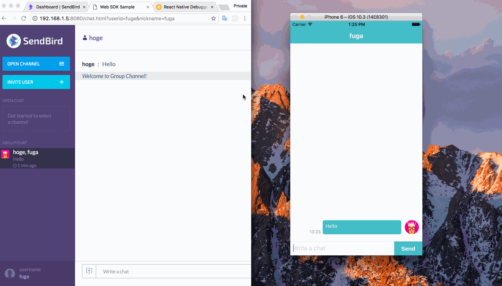

# SendBirdSample

This is a sample chat application which is using [SendBird](https://sendbird.com/).
SendBird is a SaaS to offer messaging SDK and chat API for mobile apps and websites.



## Motivation

I would like to investigate SendBird, so I created this.
If you also want to research SendBird, I hope you will find this useful.

## How to use

1. Register SendBird, and create an app. Then you can get `App ID`, please make a note of it.
2. Clone this repo.
```sh
$ git clone https://github.com/saitoxu/SendBirdSample.git
```
3. Rewrite app id and user ids in `src/SendBirdSample.js`.
```sh
$ vim src/SendBirdSample.js
```
```js
// here
const sb = new SendBird({ 'appId': 'YOUR_APP_ID' })
const myUserId = 'hoge'
const friendUserId = 'fuga'
```
4. Start the app.
```sh
$ react-native run-ios
```

I recommend to use [SendBird-JavaScript/web-sample](https://github.com/smilefam/SendBird-JavaScript/tree/master/web-sample) for chat partner.
